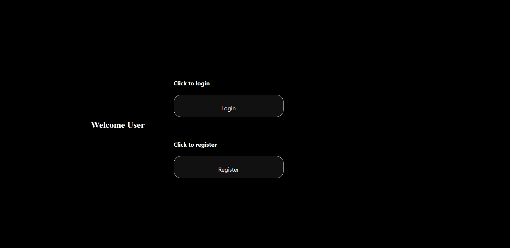
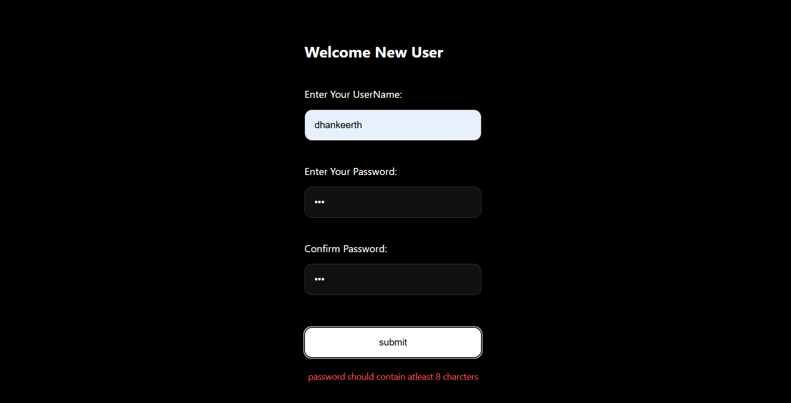
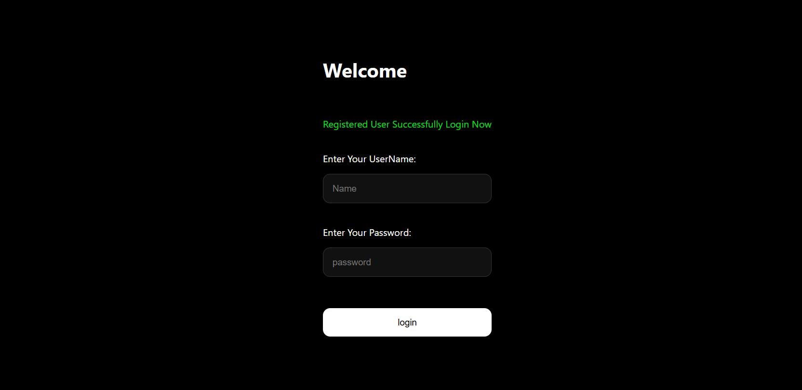
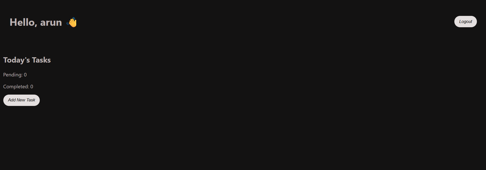
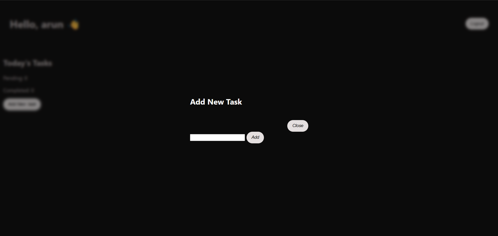
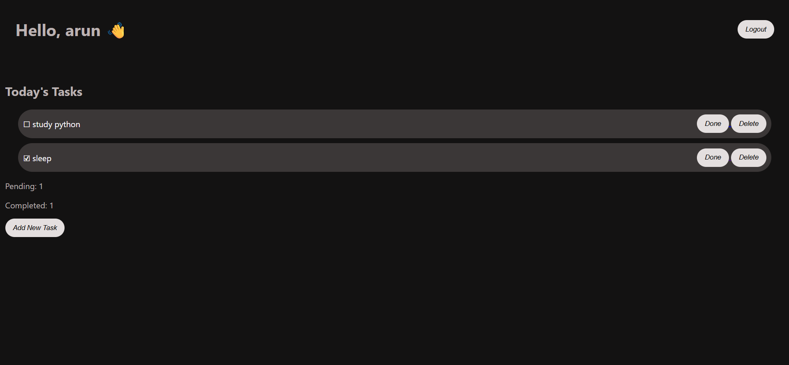

# ToDo DoItYourSelf

A full-stack Todo application built using Flask and PostgreSQL. The project allows users to register, log in securely, manage personal tasks, track completion status, and maintain a personalized dashboard.

---
## Live Demo

https://todo-doityourself.onrender.com

### Authentication

* User Registration
* User Login
* Password Hashing using Werkzeug
* Session Management
* Logout Functionality
* Duplicate User Validation
* Invalid Login Handling
* Flash Messages for User Feedback

### Task Management

* Add New Tasks
* Delete Tasks
* Mark Tasks as Completed
* Toggle Task Status
* View Pending Task Count
* View Completed Task Count

### User Interface

* Dashboard for Logged-in Users
* Popup-Based Task Creation
* Flash Message Notifications
* Dark Theme Interface
* Responsive Layout Using HTML, CSS, and JavaScript

---

## Tech Stack

### Backend

* Python
* Flask

### Database

* PostgreSQL
* psycopg2

### Frontend

* HTML
* CSS
* JavaScript
* Jinja2 Templates

### Security

* Werkzeug Password Hashing
* Flask Sessions

### Version Control

* Git
* GitHub

---

## Project Structure

```text
MINI_1ST
│
├── app.py
├── requirements.txt
├── README.md
│
└── templates
    ├── home.html
    ├── login.html
    ├── register.html
    └── dashboard.html
```

---

## Database Schema

### User Table

| Column   | Type                  |
| -------- | --------------------- |
| id       | Integer (Primary Key) |
| name     | Text                  |
| password | Text                  |

### Tasks Table

| Column | Type                  |
| ------ | --------------------- |
| tid    | Integer (Primary Key) |
| name   | Text                  |
| t_name | Text                  |
| status | Boolean               |

---

## Application Flow

### User Registration

1. User enters username and password.
2. System checks whether the username already exists.
3. Password is hashed before storage.
4. User record is inserted into PostgreSQL.
5. Success message is displayed.
6. User is redirected to Login.

---

### User Login

1. User enters credentials.
2. Username is searched in database.
3. Password hash is verified.
4. Session is created.
5. User is redirected to Dashboard.

---

### Dashboard

After login:

* User-specific tasks are displayed.
* Completed and pending counts are shown.
* Tasks can be marked complete.
* Tasks can be deleted.
* New tasks can be added through a popup form.

---

## Routes

| Route         | Method | Description        |
| ------------- | ------ | ------------------ |
| /             | GET    | Home Page          |
| /login        | GET    | Login Page         |
| /logindata    | POST   | Login Validation   |
| /register     | GET    | Registration Page  |
| /registerdata | POST   | Register New User  |
| /dashboard    | GET    | User Dashboard     |
| /addpopuptask | POST   | Add Task           |
| /done/<id>    | GET    | Toggle Task Status |
| /delete/<id>  | GET    | Delete Task        |
| /logout       | GET    | Logout User        |

---

## Installation

### Clone Repository

```bash
git clone https://github.com/Dhankeerth/ToDo-DoItYourSelf.git
```

### Enter Project Directory

```bash
cd ToDo-DoItYourSelf
```

### Install Dependencies

```bash
pip install -r requirements.txt
```

### Configure PostgreSQL

Create the required database and tables.

### Run Application

```bash
python app.py
```

Visit:

```text
http://127.0.0.1:5000
```

---

## Future Improvements

* Cloud Database Integration
* Application Hosting
* Mobile Responsive Design
* Task Categories
* Due Dates and Reminders
* Search and Filter Tasks
* User Profile Management

---

## Learning Outcomes

This project was built from scratch to learn:

* Flask Development
* PostgreSQL Integration
* CRUD Operations
* Authentication Systems
* Session Management
* Password Hashing
* Frontend and Backend Integration
* Git and GitHub Workflow
* Full-Stack Application Development

---

## Screenshots

### Home Page



### Register Page



### Login Page



### Dashboard



### Add Task


### To DO - DoItYourSelf



## Author

**Dhankeerth**

First Full-Stack Flask + PostgreSQL Project

**ToDo DoItYourSelf v1.0**
